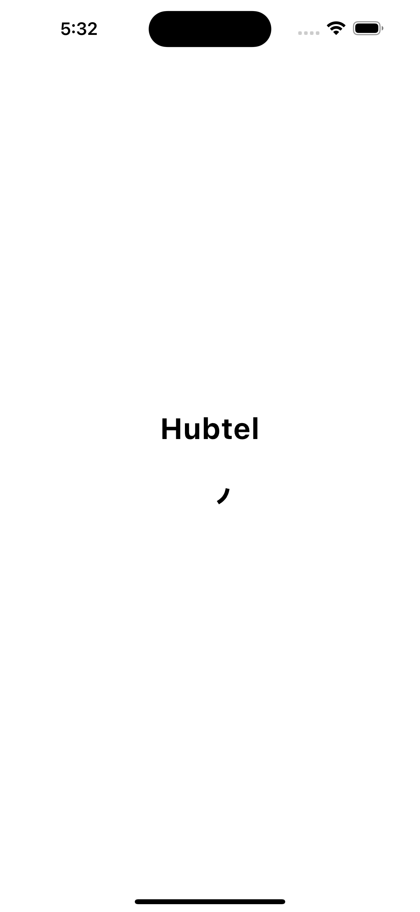

Hubtel Flutter Coding Challenge
This Flutter project is my submission for the Hubtel Flutter coding challenge.

Getting Started
To get started with this project, follow the steps below:

Prerequisites
Flutter SDK: Make sure you have Flutter installed on your local machine. For installation instructions, refer to the Flutter documentation.

Installation
Clone the repository to your local machine:

bash
Copy code
git clone <https://github.com/senyomotey/hubtel.git>
Navigate to the project directory:

bash
Copy code
cd hubtel_flutter_challenge
Install the dependencies:

Copy code
flutter pub get

Usage
Connect your mobile device or start an emulator.

Run the app:

Copy code
flutter run

Screenshots

Project Structure
The project follows the standard Flutter project structure:

lib/: Contains the main Dart code for the app.
main.dart: Entry point of the app.
screens/: Contains the different screens of the app.
tabs/: Contains the tabs used in the app.
assets/: Contains the static assets used in the app (images, fonts, etc.).
test/: Contains the unit and widget tests for the app.
pubspec.yaml: Defines the dependencies and assets used in the app.

Testing
The project includes unit tests and widget tests to ensure the functionality of the app. To run the tests, use the following command:

bash
Copy code
flutter test
Contributing
[Include information on how others can contribute to your project if applicable]

License
[Specify the license under which the project is distributed (e.g., MIT License)]

Contact
For any inquiries or feedback regarding this project, please contact Senyo Motey at <moteysenyo@gmail.com>
